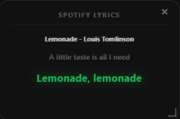

# Spotify Lyrics Overlay

An ultra-lightweight, customizable, and responsive desktop lyrics overlay for Spotify on Windows. Built using **Neutralinojs**, it leverages your system's native Edge/WebView2 rendering engine to display stunning glassmorphic, Apple Music-style synchronized scrolling lyrics at a tiny size of **under 2 Megabytes** (a 98% reduction from its original 91.6MB Electron implementation).

<p align="center">
  
</p>

<p align="center">
  
</p>

<p align="center">
  
</p>

---

## ⚡ Comparison: The Lightest Lyrics App

| Metric / Feature | **Spotify Lyrics Overlay** | **Spicetify (popup-lyrics)** | **Musixmatch Desktop** |
| :--- | :--- | :--- | :--- |
| **Disk Size** | 🚀 **< 2 MB** | ~150 MB | ~300 MB |
| **Memory Usage** | 🔋 **~15-20 MB** | ~150 MB+ (embedded inside Spotify) | ~300 MB+ (Electron shell) |
| **Credentials** | Client ID only (PKCE) | Local Spotify client hooks | In-app login |
| **Lyrics Fallback** | **4-Level Pipeline** (Lrclib ➔ NetEase ➔ Musixmatch ➔ Lyrics.ovh) | Spotify default lyrics database | Musixmatch database only |
| **Window Type** | Borderless glassmorphic overlay | Embedded browser extension | Standalone heavy window |

---

## Features

- **Apple Music-Style Synced Scrolling**: Real-time sync loop (`requestAnimationFrame`) utilizing a robust timing scan to scroll the active lyrics line smoothly with zero CPU overhead.
- **RCE-Safe Base64 Command Parsing**: Calls local helper binaries via Base64-JSON encoded arguments. This seals command parameter injection vulnerabilities from song metadata or redirect URLs.
- **Client-Side PKCE OAuth Flow**: Complete elimination of client secrets (`SPOTIFY_CLIENT_SECRET`). Uses browser-based PKCE (Proof Key for Code Exchange) flow directly over `fetch`, making credentials sharing obsolete.
- **CSRF Protection & Port Security**: Standard loopback address (`http://127.0.0.1:8888/callback`) with state verification matching UUID keys to block Cross-Site Request Forgery (CSRF).
- **Multi-Provider Scraper Pipeline**: Queries Lrclib, NetEase, and Lyrics.ovh concurrently using native compiled C# helper threads. **Musixmatch (reverse-engineered) is opt-in disabled by default** for licensing safety.
- **Local Disk-based LRU Lyrics Cache**: Caches searched lyrics locally in `lyrics_cache.json` for instant 0ms load times on replays. Keeps cache size under 50 items.
- **WebView2 Transparency & Control Fixes**:
  - Drag the borderless window easily from the designated top header bar.
  - Jitter-free window resizing using Pointer Events and pointer captures.
  - User-select disabled globally to prevent accidental text selections.
- **Antivirus Hardened**: Spawns native compiled C# executables (`.exe`) instead of PowerShell script files bypassing policies, preventing false-positive security flags.

---

## Quick Start (One-Liner Install)

1. Download the latest release `.zip` or install via `SpotifyLyricsOverlay-Setup-2.4.0.exe` from [GitHub Releases](https://github.com/bnbidipta/spotify-lyrics-overlay/releases).
2. Configure your Spotify Client ID (no client secret is needed):
   - Go to the [Spotify Developer Dashboard](https://developer.spotify.com/dashboard).
   - Edit Settings of your App ➔ Add Redirect URI: `http://127.0.0.1:8888/callback`.
3. Open PowerShell in the app folder and run this one-liner to create your configuration:
   ```powershell
   "SPOTIFY_CLIENT_ID=your_id_here" | Out-File -FilePath .env -Encoding utf8
   ```
4. Double-click **`spotify-lyrics-overlay.exe`** to launch the overlay.
5. Click **Login to Spotify** (this launches your browser to verify your account).
6. Play any song on Spotify!

---

## Workspace Directory Structure

```
├── .github/workflows/           # GitHub Actions Build pipeline
│   └── build.yml
├── neutralino-app/              # Application source code
│   ├── resources/               # HTML, CSS, JavaScript, and asset files
│   │   ├── css/
│   │   ├── js/                  # main.js PKCE authentication & rendering logic
│   │   ├── icons/               # App Icons
│   │   └── index.html           # Frame layout and HTML structure (with CSP)
│   ├── neutralino.config.json   # Neutralino configuration and mode profiles
│   ├── auth_listener.cs         # OAuth code callback redirect listener (C# source)
│   ├── fetch_lyrics.cs          # Unified parallel scraper (C# source)
│   ├── secure_store.cs          # DPAPI secure local storage helper (C# source)
│   └── window_utils.cs          # Native transparency window styles helper (C# source)
│
├── dist_release/                # Dynamic local release/packaging output
├── installer.iss                # Inno Setup Windows installer configuration
├── build_and_push.ps1           # Release build automation script
└── .env                         # Local configuration environment
```

---

## Building and Developing

### Prerequisites
- Node.js installed.
- [WebView2 Runtime](https://developer.microsoft.com/en-us/microsoft-edge/webview2/) (preinstalled on Windows 10/11).
- MSBuild / .NET Framework `csc.exe` (installed by default with Windows).
- Inno Setup Compiler (optional, for compiling installers).

### Build steps:
1. Navigate into the source folder:
   ```bash
   cd neutralino-app
   ```
2. Build the distribution package:
   ```bash
   npx @neutralinojs/neu build
   ```
   This generates the compiled binaries and `resources.neu` inside `neutralino-app/dist/`.

---

## Disclaimer

This application is not affiliated with, authorized, maintained, sponsored, or endorsed by Spotify or any of its affiliates or partners. Lyrics displayed in the application are retrieved dynamically from public third-party services (Lrclib, NetEase, Lyrics.ovh, and optionally Musixmatch) and are subject to their respective terms of service.

---

## License

ISC License. Made with ❤️ for Spotify overlays.
